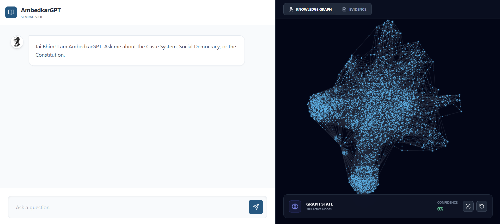
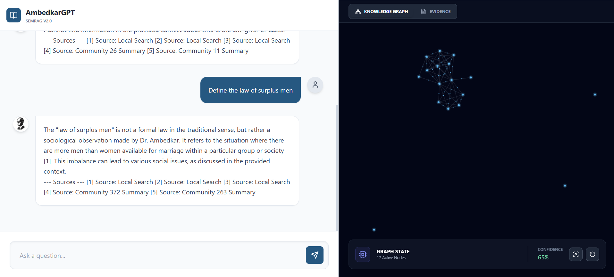
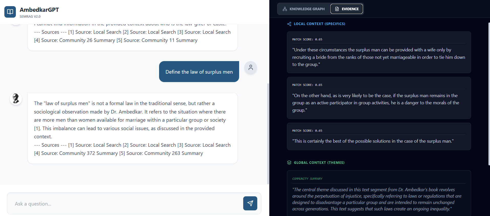

# AmbedkarGPT 2.0: SemRAG Architecture Implementation


**AmbedkarGPT** is a sophisticated **Retrieval-Augmented Generation (RAG)** system built on the **SemRAG (Semantic RAG)** architecture. Unlike standard RAG systems that rely solely on vector similarity, AmbedkarGPT constructs a **Semantic Knowledge Graph** from unstructured text, enabling it to answer complex queries by understanding relationships between entities (Local Search) and broad thematic clusters (Global Search).

The system is designed to analyze Dr. B.R. Ambedkar's seminal work, *"Castes in India: Their Mechanism, Genesis and Development"*.

---

## 📸 Project Demo

### 1. The Interactive Dashboard
*A clean, research-oriented interface featuring a 55/45 split between the Chat Intelligence and the Knowledge Graph.*



### 2. Dynamic Knowledge Graph (Local Search)
*When a user asks about "Endogamy", the graph dynamically zooms in to isolate relevant nodes (Sati, Widowhood) while the physics engine spreads them for clarity.*



### 3. Evidence & Citation Engine (Global Search)
*The "Evidence Tab" allows users to verify the AI's claims. It displays specific text chunks (Local Context) and broad thematic summaries (Global Context) with confidence scores.*



---

## 🧠 System Architecture

The project implements the **SemRAG** architecture, combining Graph Theory with Vector Search for high-precision retrieval.

### 1. Data Pipeline (Semantic Chunking)
* **Algorithm:** Semantic Chunking via Cosine Similarity.
* **Logic:** Instead of fixed-size splitting, sentences are grouped based on semantic coherence using `all-MiniLM-L6-v2` embeddings. A buffer merger ensures context is preserved across sentence boundaries.

### 2. Knowledge Graph Construction
* **Entity Extraction:** Uses `spaCy` to identify key entities (PERSON, ORG, CONCEPT).
* **Graph Building:** Constructs a network (`NetworkX`) where nodes are entities and edges represent co-occurrence in text chunks.
* **Community Detection:** Applies the **Louvain Algorithm** to detect hierarchical communities (themes) within the graph.

### 3. Hybrid Retrieval Engine
* **Local Search (Equation 4):** Retrieves specific facts by mapping the query to graph entities and fetching their direct neighbors.
* **Global Search (Equation 5):** Retrieves broad themes by matching the query against pre-generated **Community Summaries**.
* **Re-Ranking:** A **Cross-Encoder** (`ms-marco-MiniLM-L-6-v2`) re-scores the retrieved candidates to filter out hallucinations and noise.

---

## 🚀 Tech Stack

### Backend (Python & AI)
* **Framework:** FastAPI (High-performance Async API)
* **LLM Orchestration:** LangChain, Ollama (Mistral 7B)
* **Graph Processing:** NetworkX, CDLib (Community Detection)
* **Embeddings:** Sentence-Transformers (HuggingFace)
* **Vector Operations:** NumPy, Scikit-Learn (Cosine Similarity)

### Frontend (Modern Web)
* **Framework:** React.js + Vite
* **Styling:** Tailwind CSS (Custom "Ambedkar Blue" Theme)
* **Visualization:** `react-force-graph-2d` (Interactive Knowledge Graph)
* **Icons & Markdown:** Lucide React, React-Markdown

---

## 📂 Project Structure

```text
ambedkargpt/
├── backend/                          # 🐍 PYTHON SERVER
│   ├── data/                         # Source PDFs
│   ├── processed/                    # Generated Graphs (.gml) & Chunks (.json)
│   ├── src/
│   │   ├── chunking/                 # Semantic Chunking Logic
│   │   ├── graph/                    # Entity Extraction & Community Detection
│   │   ├── retrieval/                # Local/Global Search Algorithms
│   │   ├── llm/                      # Mistral Integration
│   │   └── pipeline/                 # Core Orchestrator
│   ├── main.py                       # FastAPI Entry Point
│   ├── config.yaml                   # Model & Path Configurations
│   └── requirements.txt              # Python Dependencies
│
├── frontend/                         # ⚛️ REACT CLIENT
│   ├── src/
│   │   ├── App.jsx                   # Main UI Dashboard
│   │   ├── index.css                 # Tailwind Styles
│   │   └── ...
│   ├── public/                       # Static Assets (Images)
│   ├── package.json                  # JS Dependencies
│   └── vite.config.js                # Build Config
│
├── screenshots/                      # 📸 DEMO IMAGES
│   ├── dashboard.jpg
│   ├── search.jpg
│   └── evidence.jpg
│
└── README.md                         # Documentation

```

🛠️ Installation & Setup
Prerequisites
Python 3.10+

Node.js & npm

Ollama installed and running (ollama serve) with Mistral model (ollama pull mistral)

# Backend Setup
Navigate to the backend directory and install Python dependencies.
```
cd backend
pip install -r requirements.txt
python -m spacy download en_core_web_sm
Initialize the Data Pipeline: Run the build scripts once to generate the Knowledge Graph.
```
# 1. Chunk the PDF
```
python -m src.chunking.semantic_chunker
```
# 2. Build the Graph & Communities
```
python -m src.graph.graph_builder
```
# 3. Generate Community Summaries (Requires Ollama running)
```
python -m src.graph.summarizer
Start the API Server:

uvicorn main:app --reload
Server runs at: http://127.0.0.1:8000
```

# Frontend Setup
Open a new terminal, navigate to the frontend directory, and install JS dependencies.

```
cd frontend
npm install
```

Start the Web Interface:
    
```
npm run dev

```
App runs at: http://localhost:5173

## 🖥️ Usage Guide

1.  **Launch:** Ensure both Backend (`uvicorn`) and Frontend (`npm run dev`) terminals are running.
2.  **Interact:** Open `http://localhost:5173`.
3.  **Local Query:** Ask specific questions like *"Who is Manu?"* or *"Define Endogamy."*
    * *Observation:* The Graph View will zoom into specific nodes.
4.  **Global Query:** Ask thematic questions like *"What are the main arguments against Caste?"*
    * *Observation:* Switch to the **Evidence Tab** to see Community Summaries.
5.  **Visualize:** Use the **Knowledge Graph** tab to explore relationships between entities dynamically.

---

## 🔬 Key Features

* **Dynamic Graph Rendering:** The frontend visualizes only the subgraph relevant to the current query, preventing information overload.
* **Citation Engine:** Every response strictly cites the source chunk ID `[1]`, ensuring grounding and traceability.
* **Confidence Metrics:** The dashboard displays the retrieval confidence score (from the Cross-Encoder) for every answer.
* **Negative Constraint:** The system is engineered to refuse out-of-domain questions (e.g., "What is Python?") to prevent hallucination.

---

## 🔮 Future Roadmap

* **Graph Database:** Migrate from NetworkX (In-Memory) to Neo4j for scalability.
* **Multi-Modal RAG:** Support image extraction from historical manuscripts.
* **Fine-Tuning:** Fine-tune the Mistral model on Indian Sociology texts for better domain alignment.

---

**Developed by KESHAV SHARMA**
*AI and Data Science Engineer*
